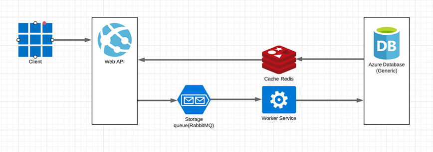

# README #

Barber Shop Booking Api

## BarberShop api Project
Overall design:

 
This project consists of a solution capable of reproducing small functionalities typical for a booking system.

## Functionalities: 
User can search for bookings both by booking Id.
Users can get the list of all bookings.
Bookings can be created.

## Flows
### Create booking
To create a booking we do call to a Post endpoint in web API, and a “bookingCreated” message is created and published to a “ booking requests” topic in the queue.The worker service subscribes to the “booking requests” topic and will consume messages from the queue, process them and save data to the database.

### Search for booking
To search for a booking, we do call to a Get endpoint in web API,  then we do a call to the Redis cache. When the first time a request is made a call will have to be made to the database to process the query (cache miss). Before giving back the result to the user, the result will be saved in the cache. 
When the second time a user makes this same request, the application will check your cache first to see if the result for that request is cached or not. If it is then the result will be returned from the in-memory store (cache hit). The response time for the second time request will be a lot less than the first time
